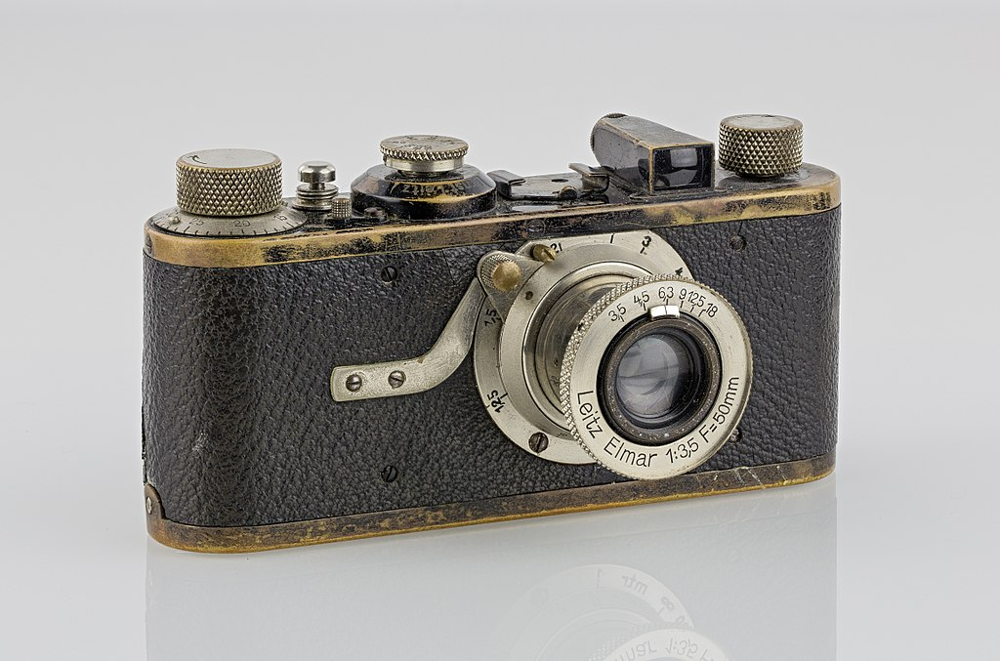
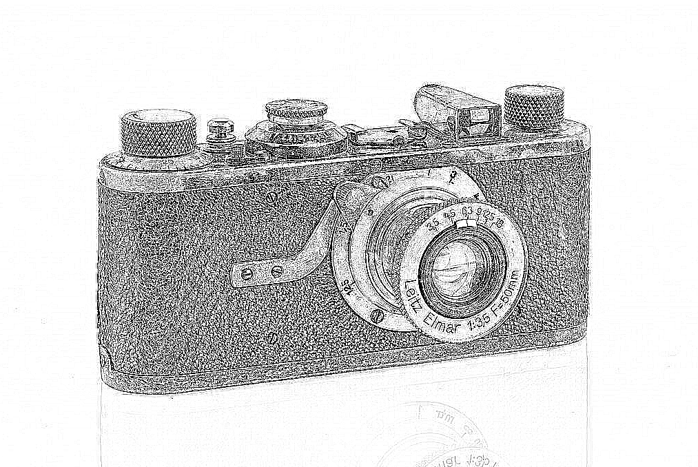

# pencil-sketch
Normal image(jpg/png/jpeg) to sketch<br>
This project demonstrates how to apply sketch effect in an image.<br>
This projects involves various methods like image sharpening, applying grayscale, gaussian blurs and <br>
invertion of an image.This project is a combination of our previous basic projects.<br>


## Installation
install cv2 and numpy.


```bash
pip install cv2
pip install numpy
```

## Import
Use keyword to import modules.
```python
import cv2
import numpy as np
```

## Images
<p align="center">
	
	
</p>


